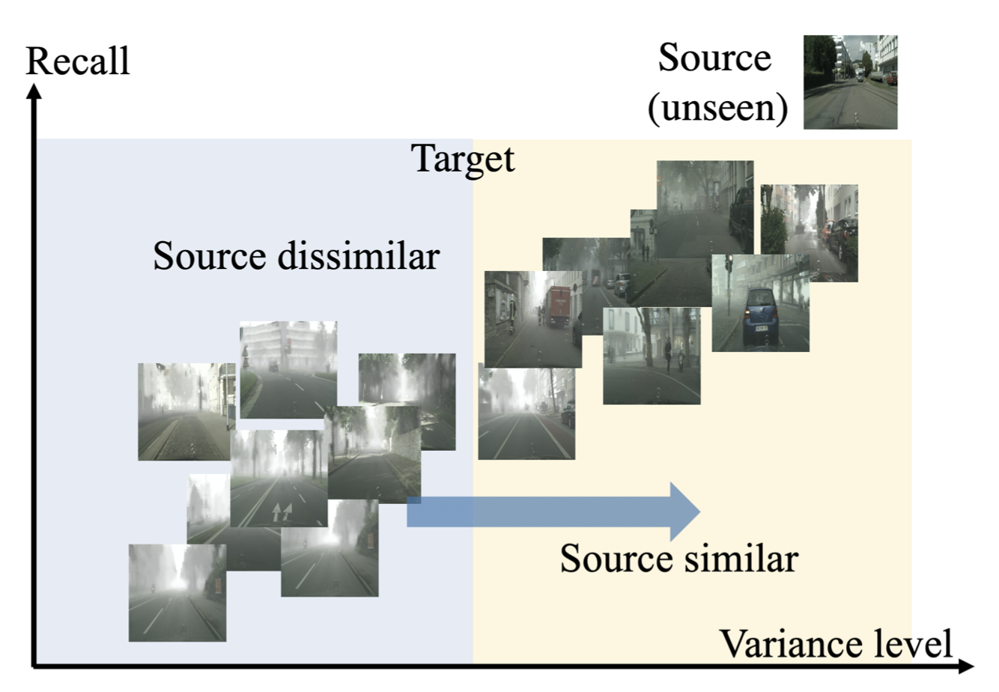

<table border="0">
  <tr>
    <td width="75%">
      <h1>Shuyan Li</h1>
      
<b>Postdoctoral Research Associate</b>

      
<b>Department of Engineering, University of Cambridge</b>

      
<b>Email: sl2141@cam.ac.uk</b>

    </td>
    <td width="25%">
        
    </td>
  </tr>
</table>

# Biography
             
I am currently a Postdoctoral Research Associate in Department of Engineering at University of Cambridge, working with Prof. <a href="http://www.eng.cam.ac.uk/profiles/ib340">Ioannis Brilakis</a>. My role is to lead a work package of BIM2TWIN project, funded by European Commission H2020. I am broadly interested in computer vision and machine learning. My current research focuses on representation learning, point cloud processing and transfer learning.

In Jan. 2022, I got my doctor's degree in the Department of Automation at Tsinghua University, <a href="http://ivg.au.tsinghua.edu.cn/index.php">Intelligent Vision Group(IVG)</a>. I was supervised by Prof. <a href="http://ivg.au.tsinghua.edu.cn/Jiwen_Lu/"> Jiwen Lu </a>, Prof. <a href="http://www.au.tsinghua.edu.cn/info/1110/1583.htm"> Jie Zhou </a> and Prof. <a href="https://www.sigs.tsinghua.edu.cn/lx/"> Xiu Li </a>. 
<!-- After that, I stayed in Tsinghua University as a Research Associate, waiting for a US visa. I am grateful to Prof. Xiu Li for giving me the opportunity to improve my ability of project management and supervision.   -->
  
# News
2023-01: My doctorate thesis is awarded as Excellent Doctorate Dissertation by ShenZhen Association for Artificial Intelligence (3 people awarded
per annual).

2023-01: I gave a seminar talk at Division D, Department of Engineering at University of Cambridge to introduce unsupervised learning for digital twins. Thanks Prof. Ioannis Brilakis for the invitation!

2022-11: 1 paper on transfer learning was accepted by <a href="https://aaai.org/Conferences/AAAI-23/">AAAI'2023</a> as oral presentation.

2022-10: I started a role as a Postdoctoral Research Associate in Department of Engineering, University of Cambridge.

2022-02: I got an <a href="https://athena.duke.edu/education-outreach"> Athena Post-Doctoral Fellowship</a> funded by NSF.

2021-06: 1 paper on video hashing was accepted by <a href="https://ieeexplore.ieee.org/xpl/RecentIssue.jsp?punumber=76">IEEE TCSVT</a>.

2021-03:  1 paper on video hashing was accepted by <a href="http://cvpr2021.thecvf.com">CVPR'2021</a>.

  
# Publications
<table border="0">
 <tr>
            <td width="25%">
              
            </td>
            <td width="75%" valign="center">
              <papertitle>Adversarial Alignment for Source Free Object Detection</papertitle>
               
              Qiaosong Chu, <strong>Shuyan Li</strong>, Guangyi Chen, Kai Li and Xiu Li
               
              <em>Association for the Advancement of Artificial Intelligence (<strong>AAAI</strong>)</em>, 2023
               
              <a href="https://arxiv.org/pdf/2301.04265.pdf">[PDF]</a> 
              <a href="AAAI.mp4">[Video]</a> 
<!--               <a href="https://github.com/ChuQiaosong">[Code]</a> -->
               
              

              
 We propose an adversarial learning based source free object detection method.

            </td>
</tr>
</table> 

<table border="0">
 <tr>
            <td width="25%">
              
            </td>
            <td width="75%" valign="center">
              <papertitle>Structure-adaptive Neighborhood Preserving Hashing for Scalable Video Search</papertitle>
               
              <strong>Shuyan Li</strong>, Xiu Li, Jiwen Lu and Jie Zhou
               
              <em>IEEE Transactions on Circuits and Systems for Video Technology (<strong>TCSVT</strong>)</em>, 2021
               
              <a href="Structure-adaptive Neighborhood Preserving Hashing for Scalable Video Search.pdf">[PDF]</a>
               
              

              
 This is the journal version of NPH. Compared with NPH, we further develop an encoding network that can capture the hierachical structure of a video.

            </td>
</tr>
</table> 

<table border="0">
 <tr>
            <td width="25%">
              
            </td>
            <td width="75%" valign="center">
              <papertitle>Self-supervised Video Hashing via Bidirectional Transformers</papertitle>
               
              <strong>Shuyan Li</strong>, Xiu Li, Jiwen Lu and Jie Zhou
               
              <em>IEEE Conference on Computer Vision and Pattern Recognition (<strong>CVPR</strong>)</em>, 2021
               
              <a href="Self-supervised Video Hashing via Bidirectional Transformers.pdf">[PDF]</a> <a href="https://github.com/Lily1994/BTH">[Code]</a> 
               
              

              
We propose a self-supervised learning framework to capture bidirectional correlations among videos based on transformers.

            </td>
</tr>
</table>  

<table border="0">
 <tr>
            <td width="25%">
              
            </td>
            <td width="75%" valign="center">
              <papertitle>Neighborhood Preserving Hashing for Scalable Video Retrieval</papertitle>
               
              <strong>Shuyan Li</strong>, Zhixiang Chen, Jiwen Lu, Xiu Li, and Jie Zhou
               
              <em>IEEE International Conference on Computer Vision (<strong>ICCV</strong>)</em>, 2019
               
              <a href="Neighborhood Preserving Hashing for Scalable Video Retrieval.pdf">[PDF]</a>  
               
              

              
We learn video hash functions via exploiting the neighborhood structure among videos.

            </td>
</tr>
</table>
  
<table border="0">
 <tr>
            <td width="25%">
              
            </td>
            <td width="75%" valign="center">
              <papertitle>Unsupervised Variational Video Hashing with 1D-CNN-LSTM Networks</papertitle>
               
              <strong>Shuyan Li</strong>, Zhixiang Chen, Xiu Li, Jiwen Lu, and Jie Zhou
               
              <em>IEEE Transactions on Multimedia (<strong>TMM</strong>)</em>, 2020
               
              <a href="Unsupervised variational video hashing with 1D-CNN-LSTM Networks.pdf">[PDF]</a>
               
              

              
We propose a variational mechanism to learn robust video hash representation. 

            </td>
</tr>
</table>

# Teaching
<b>Demonstrator & Marking, 3F8 Inference, Department of Engineering, University of Cambridge, Lent term 2023
  
<b>TA, Computer culture basis, awarded as "Outstanding TA", Tsinghua University, Fall 2020

<b>Teacher, Music, Central elementary school in Huangtu Town, Guizhou Province, Summer 2021

# Academic Services

<b>Conference Reviewer:</b> AAAI2023, ICME2022, PRCV2022, ICME2021, ICME2020, WACV2020, ICIP 2020, etc.

<b>Journal Reviewer:</b>  IEEE/ACM TASLP, IEEE TIP, IEEE TMM, IEEE TCSVT, PR, Neuralcomputing, etc.

&copy; Shuyan Li | Last updated: Feb., 2023

