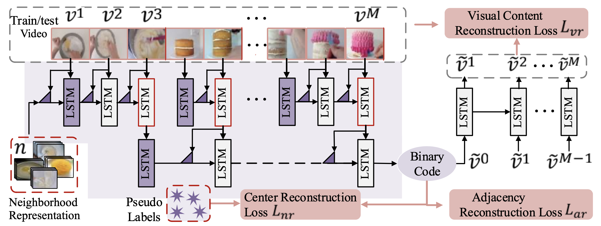
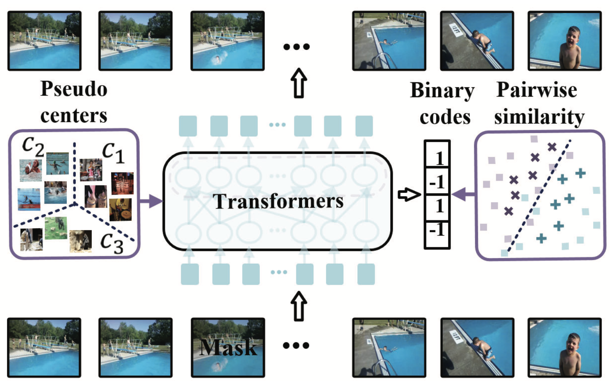
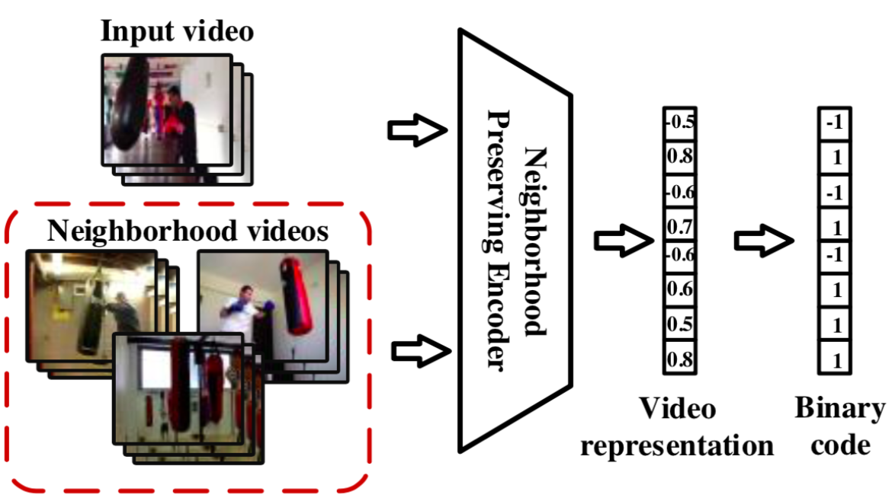
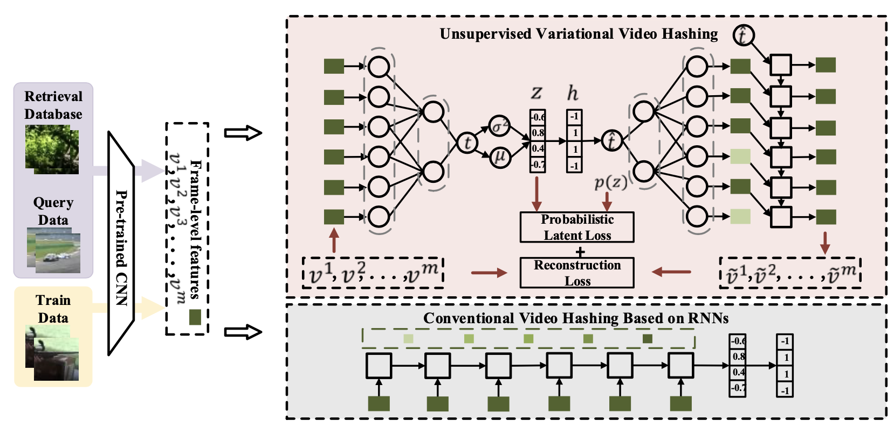

<table border="0">
  <tr>
    <td width="75%">
      <h1>Shuyan Li</h1>
      
<b>PhD</b>

      
<b><a href="http://ivg.au.tsinghua.edu.cn/index.php">Intelligent Vision Group(IVG)</a></b>

      
<b>Department of Automation, Tsinghua University</b>

      
<b>Email: li-sy16@tsinghua.org.cn</b>

    </td>
    <td width="25%">
        
    </td>
  </tr>
</table>

# Biography
             
In 2022, I got my doctor's degree in the Department of Automation at Tsinghua University. I was advised by Prof. <a href="https://www.sigs.tsinghua.edu.cn/lx/"> Xiu Li </a>, Prof. <a href="http://www.au.tsinghua.edu.cn/info/1110/1583.htm"> Jie Zhou </a> and Prof. <a href="http://ivg.au.tsinghua.edu.cn/Jiwen_Lu/"> Jiwen Lu </a>. In 2016, I obtained my B.Eng. in the School of Mechanical Engineering and Electronic Information, China University of Geosciences. Now I am in a transitory stage, and I work as a research assistant in Tsinghua Shenzhen International Graduate School. I am seeking for a good position, wish me good luck!
              
I am broadly interested in computer vision and deep learning. My current research focuses on scalable visual retrieval, metric learning, video representation learning.

  
# News

2021-6: 1 paper on video hashing was accepted by <a href="https://ieeexplore.ieee.org/xpl/RecentIssue.jsp?punumber=76">IEEE TCSVT</a>.

2021-3:  1 paper on video hashing was accepted by <a href="http://cvpr2021.thecvf.com">CVPR'2021</a>.

2019-10: 1 paper on video hashing was accepted by <a href="https://ieeexplore.ieee.org/xpl/RecentIssue.jsp?punumber=6046">IEEE TMM</a>.

2019-07: 1 paper on video hashing was accepted by <a href="http://iccv2019.thecvf.com/">ICCV'2019</a>.

  
# Publications
<table border="0">
 <tr>
            <td width="25%">
              
            </td>
            <td width="75%" valign="center">
              <papertitle>Structure-adaptive Neighborhood Preserving Hashing for Scalable Video Search</papertitle>
               
              <strong>Shuyan Li</strong>, Xiu Li, Jiwen Lu and Jie Zhou
               
              <em>IEEE Transactions on Circuits and Systems for Video Technology (<strong>TCSVT</strong>)</em>, 2021
               
              <a href="Structure-adaptive Neighborhood Preserving Hashing for Scalable Video Search.pdf">[PDF]</a>
               
              

              
 We propose a Structure-adaptive Neighborhood Preserving Hashing (SNPH) method for unsupervised scalable video search.

            </td>
</tr>
</table> 

<table border="0">
 <tr>
            <td width="25%">
              
            </td>
            <td width="75%" valign="center">
              <papertitle>Self-supervised Video Hashing via Bidirectional Transformers</papertitle>
               
              <strong>Shuyan Li</strong>, Xiu Li, Jiwen Lu and Jie Zhou
               
              <em>IEEE Conference on Computer Vision and Pattern Recognition (<strong>CVPR</strong>)</em>, 2021
               
              <a href="Self-supervised Video Hashing via Bidirectional Transformers.pdf">[PDF]</a> <a href="https://github.com/Lily1994/BTH">[Code]</a> 
               
              

              
We propose a self-supervised learning framework for video hashing based on bidirectional transformers.

            </td>
</tr>
</table>  

<table border="0">
 <tr>
            <td width="25%">
              
            </td>
            <td width="75%" valign="center">
              <papertitle>Neighborhood Preserving Hashing for Scalable Video Retrieval</papertitle>
               
              <strong>Shuyan Li</strong>, Zhixiang Chen, Jiwen Lu, Xiu Li, and Jie Zhou
               
              <em>IEEE International Conference on Computer Vision (<strong>ICCV</strong>)</em>, 2019
               
              <a href="Neighborhood Preserving Hashing for Scalable Video Retrieval.pdf">[PDF]</a>  
               
              

              
We learn video hash functions via preserving the neighborhood structure in the video space.

            </td>
</tr>
</table>
  
<table border="0">
 <tr>
            <td width="25%">
              
            </td>
            <td width="75%" valign="center">
              <papertitle>Unsupervised Variational Video Hashing with 1D-CNN-LSTM Networks</papertitle>
               
              <strong>Shuyan Li</strong>, Zhixiang Chen, Xiu Li, Jiwen Lu, and Jie Zhou
               
              <em>IEEE Transactions on Multimedia (<strong>TMM</strong>)</em>, 2020
               
              <a href="Unsupervised variational video hashing with 1D-CNN-LSTM Networks.pdf">[PDF]</a>
               
              

              
We propose an unsupervised variational video hashing method for scalable video retrieval

            </td>
</tr>
</table>

# Academic Services

<b>Conference Reviewer:</b> ACM MM, ICME, WACV and so on.

<b>Journal Reviewer:</b>  TIP, TMM, TCSVT and so on.

&copy; Shuyan Li | Last updated: May, 2022

